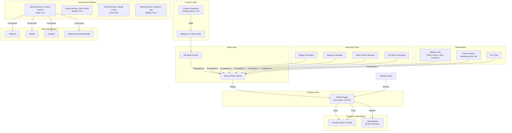

# MoneyWise Hub — System Architecture

## Overview
MoneyWise Hub is a static site (SSG) deployed to GitHub Pages, with GitHub Actions powering all automation. The site combines SEO-optimized content with interactive JavaScript tools to attract organic search traffic and convert it through affiliate links and email signups.

## System Diagram



## Data Flow

1. **Content Creation Flow:**
   - GitHub Actions cron triggers daily
   - New content added as HTML files to `content/` directory
   - Vite builds static site
   - GitHub Pages serves updated content
   - Sitemap auto-updated

2. **User Journey Flow:**
   - User finds article via Google/social media
   - Reads content → uses interactive tool
   - Sees relevant affiliate recommendation → clicks (revenue event)
   - OR signs up for email list → enters nurture sequence → converts later

3. **Revenue Flow:**
   - Affiliate clicks → tracked via affiliate network
   - Email signups → Mailchimp → welcome sequence → monetized content
   - Ko-fi tips → direct revenue

## Tech Stack

| Component | Technology | Cost | Limit |
|---|---|---|---|
| **Frontend** | Vanilla HTML/CSS/JS + Vite | $0 | Unlimited |
| **Hosting** | GitHub Pages | $0 | 1GB storage, 100GB/mo bandwidth |
| **CI/CD** | GitHub Actions | $0 | 2,000 min/mo (public repo) |
| **Email** | Mailchimp Free Tier | $0 | 500 contacts, 1,000 sends/mo |
| **Monitoring** | UptimeRobot | $0 | 50 monitors |
| **SEO** | Google Search Console | $0 | Unlimited |
| **Domain** | username.github.io | $0 | Free subdomain |
| **CDN/HTTPS** | GitHub Pages (built-in) | $0 | Included |
| **Analytics** | Umami (self-hosted on Vercel) or simple JS tracker | $0 | Unlimited |
| **Payments** | Ko-fi, Gumroad | $0 upfront | Transaction fees only |

## File Structure

```
Make_Money/
├── index.html                 # Homepage
├── about.html                 # About page
├── tools/                     # Interactive calculators
│   ├── budget-calculator.html
│   ├── savings-calculator.html
│   ├── debt-payoff-calculator.html
│   └── net-worth-calculator.html
├── articles/                  # Blog content
│   ├── budgeting/
│   ├── saving-money/
│   ├── best-apps/
│   ├── debt-freedom/
│   └── making-money/
├── css/
│   └── style.css              # Design system
├── js/
│   ├── main.js               # Core site JS
│   ├── calculators.js         # Calculator logic
│   └── analytics.js           # Simple analytics
├── assets/
│   └── images/                # Optimized images
├── sitemap.xml                # Auto-generated
├── robots.txt                 # SEO
├── .github/
│   └── workflows/             # Automation pipelines
│       ├── publish.yml
│       ├── seo-check.yml
│       └── health-check.yml
├── STRATEGY.md
├── ARCHITECTURE.md
├── COMPETITIVE_ANALYSIS.md
├── KEYWORD_RESEARCH.md
├── REVENUE.md
├── CHANGELOG.md
└── README.md
```

## Failure Points & Fallbacks

| Failure Point | Fallback Strategy |
|---|---|
| GitHub Pages down | Unlikely (99.95% SLA), but can mirror to Netlify |
| GitHub Actions limit reached | Reduce cron frequency, batch operations |
| Mailchimp free tier exceeded | Switch to Brevo (300 emails/day free) |
| Affiliate program terminated | Maintain 5+ affiliate relationships minimum |
| Content generation fails | Retry 3x with exponential backoff, log error, skip to next day |
| Google deindexes content | Diversify traffic sources (social, email, direct) |

## Security Considerations
- No user accounts or authentication needed (static site)
- No database (zero attack surface)
- HTTPS via GitHub Pages (automatic)
- No sensitive data stored
- Affiliate links use proper rel="sponsored noopener" attributes
